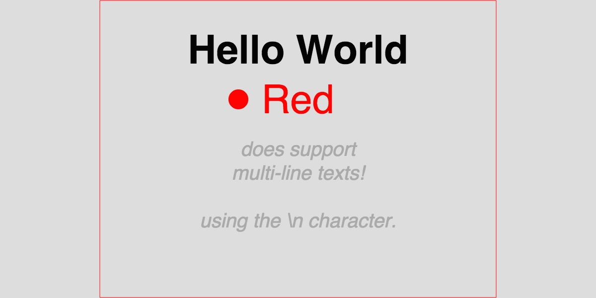

slide2d
=======
Express vectorial content in JSON using canvas2d directives

## Goal

**slide2d** is a thin wrapper to expose canvas2d API in a JSON DSL.
The goal is to statically describe scalable content.

## The format

```js
{
  "size": [ Number, Number ],
  "background": String,
  "draws": Directive[]
}
```

### `size`

You have to **define your viewport `size`** and the rendering will scale to the canvas size and will also keep your ratio (it will fit the biggest centered rectangle).

### `background`

The full canvas will be filled with a **`background` color**.

### `draws`

Your **`draws` directives** will be used to fill and draw content. These directives are **direct mapping from [Canvas 2D context API](http://www.w3.org/TR/2dcontext/)**. Almost every possible shapes that canvas2d provides are supported with following DSL:

**`draws` directives is an array where each element `E` is either an object or an array:**
- If `E` is an *object*: all values or this object will be set to the canvas context.
- If `E` is an *array*: the first element is the canvas2d context method name and the following elements are arguments to that method.

All draws that occurs will be scaled relatively to the `size` you have defined. That way, we can define scalable (vectorial) content.

## Extension to the Canvas 2D API

There are some exceptions where the `draws` get extended.

### Multi-line texts support

`slide2d` supports multi-line texts using the `\n` character.
To do so, every texts will be split on `\n` and result of multiple texts draws.
Note that you still have to define where the new lines are.

In that context, you
**MUST provide a 4th parameter** if you want that multi-line feature: **the lineHeight in pixels**.

> Note: the `maxWidth` that allows the [canvas2d specification](http://www.w3.org/TR/2dcontext/#drawing-text-to-the-canvas) is not supported by slide2d.

## Full Example:

```js
var json = {
  "background": "#ddd",
  "size": [ 800, 600 ],
  "draws": [
    [ "beginPath" ],
    { "fillStyle": "#eee", "strokeStyle": "#f00" },
    [ "rect", 1, 1, 798, 598 ],
    [ "stroke" ],
    [ "beginPath" ],
    { "fillStyle": "#f00" },
    [ "arc", 280, 200, 20, 0, 7 ],
    [ "fill" ],
    { "font": "bold 80px sans-serif", "fillStyle": "#000", "textBaseline": "middle", "textAlign": "center" },
    [ "fillText", "Hello World", 400, 100 ],
    { "font": "normal 80px sans-serif", "fillStyle": "#f00", "textBaseline": "middle", "textAlign": "center" },
    [ "fillText", "Red", 400, 200 ],
    { "font": "italic 40px sans-serif", "fillStyle": "#aaa", "textBaseline": "middle", "textAlign": "center" },
    [ "fillText", "does support\nmulti-line texts!\n\nusing the \\n character.", 400, 300, 48]
  ]
};


function Canvas (w, h, r) {
  var canvas = document.createElement("canvas");
  canvas.width = r * w;
  canvas.height = r * h;
  canvas.style.width = w + "px";
  canvas.style.height = h + "px";
  return canvas;
}

var Slide2d = require(".");
var canvas = Canvas(600, 300, window.devicePixelRatio || 1);
var ctx = canvas.getContext("2d");
var slide2d = Slide2d(ctx);
slide2d.render(json);
document.body.appendChild(canvas);
```



Note in the example how the content is trying to take the biggest possible rectangle in the canvas viewport. For the sake of this example, we have drawn the biggest possible rectangle with a red stroke, but usually you just fill text and shapes in the middle to have a seamless rendering.


## Used by...

- [diaporama](https://github.com/gre/diaporama/)
